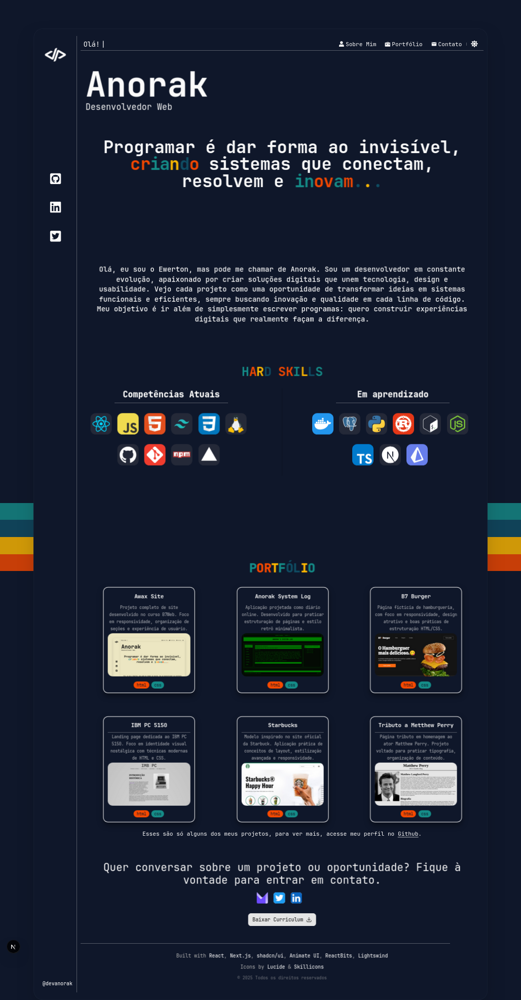

# 🛸 Anorak — Minimal Portfolio

[](https://devanorak.com.br)
[](https://nextjs.org/)
[](https://react.dev/)

Portfolio pessoal desenvolvido como **landing page**, com foco em **design minimalista**, estética retrô e **boas práticas modernas de front-end**.

🔗 **Acesse o projeto:** [devanorak.com.br](https://devanorak.com.br)

---

## 🛠️ Tech Stack

| Categoria | Tecnologias |
| :--- | :--- |
| **Framework** | Next.js 15 (App Router), React 19 |
| **Linguagem** | TypeScript |
| **Estilização** | Tailwind CSS |
| **Animações** | Framer Motion (Motion), GSAP |
| **UI/UX** | Radix UI, Lucide Icons, React Icons |
| **Deploy** | Vercel |

---

## ✨ Componentes & Customizações

O projeto utiliza uma curadoria de componentes adaptados para garantir uma experiência única:

* **ScrollReveal (Customizado):** Baseado na biblioteca *Lightswind*, este componente foi modificado para suportar efeitos de revelação tanto em blocos de texto quanto em containers complexos (modos texto e container).
* **Créditos:** As referências e bases de componentes de terceiros estão devidamente creditadas no rodapé do projeto.

---

## 🧠 Decisões Técnicas & SEO

Apesar de ser uma landing page, a arquitetura segue padrões de aplicações robustas:

### 🔍 Metadata (SEO)
Configurado via `metadata API` do Next.js para garantir consistência em compartilhamentos:

```ts
title: {
  default: "Anorak | Portfolio",
  template: "%s • Anorak",
}
```
**SEO**: Tags limpas e semânticas para melhor leitura pelos buscadores.

**Favicon**: Conjunto completo para Desktop, iOS (Apple Touch Icon) e Android (Web Manifest).

# Arquitetura

**Scalable Folders**: Estrutura de pastas pronta para novas rotas como /projects ou /about.

**Performance**: Deploy automatizado e otimizado via Vercel Edge Network.

# Como rodar localmente
```sh
# Instalar dependências
npm install

# Rodar em ambiente local
npm run dev
```

# Autor
Ewerton de Souza AKA Anorak

